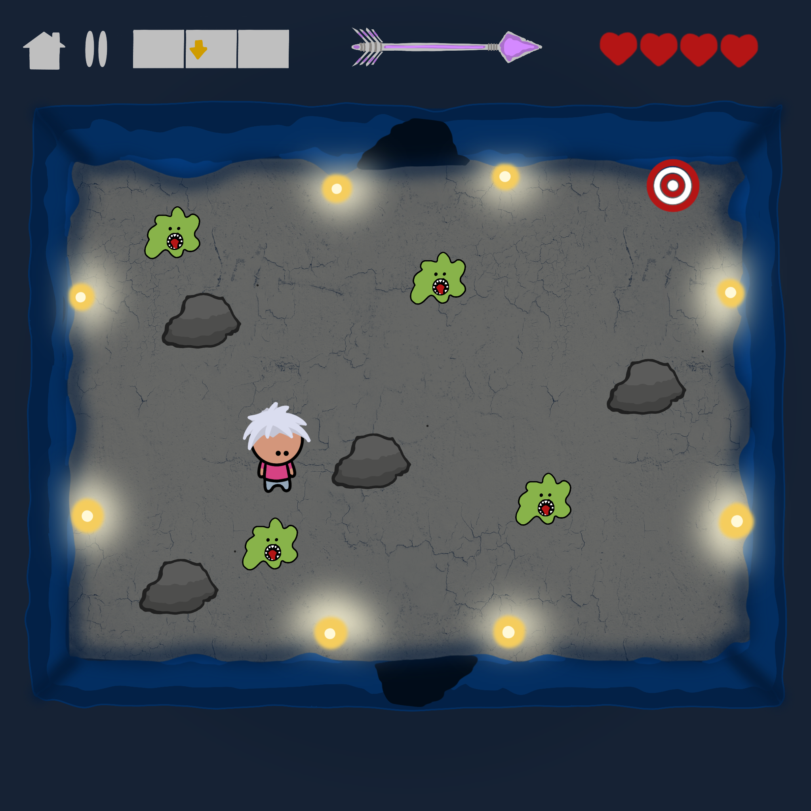

# **Soul Link**

## _Game Design Document_

---

##### Gerardo Gutiérrez, A01029422
##### Mateo Herrera, A01751912
##### Ana Paula Katsuda, A01025303

##
## _Index_

---

1. [Index](#index)
2. [Game Design](#game-design)
    1. [Summary](#summary)
    2. [Gameplay](#gameplay)
    3. [Mindset](#mindset)
    4. [Lore and Background](#lore--background)
3. [Technical](#technical)
    1. [Screens](#screens)
    2. [Controls](#controls)
    3. [Mechanics](#mechanics)
        1. [Game Builder](#game-builder)
        2. [Game](#game)
4. [Level Design](#level-design)
    1. [Themes](#themes)
    2. [Game Flow](#game-flow)
5. [Development](#development)
    1. [Classes](#classes)
6. [Graphics](#graphics)
    1. [Style Attributes](#style-attributes)
    2. [Graphics Needed](#graphics-needed)
7. [Sounds/Music](#soundsmusic)
    1. [Style Attributes](#style-attributes-1)
    2. [Sounds Needed](#sounds-needed)
    3. [Music Needed](#music-needed)
8. [Schedule](#schedule)

## _Game Design_

---

### **Summary**

Given the difficulty in teaching video game design, Soul Link is an intuitive and simple dungeon crawler type game in which the user has the ability to create a dungeon and play in it. Said dungeon can have many “rooms”, enemies and traps chosen by the game master (user). The player will need to use only one arrow to traverse the deadly maze, shooting it and recalling it as they go. The target audience for this game is anyone who is interested in game design or simply likes dungeon crawler type games.

### **Gameplay**

Being a video game focused on design, the gameplay consists of the use of tools (obstacles and enemies) to create a level. The user is free to add the elements as they wish (considering limits such as not adding two elements in the same place) and, at the end, then test their level. Specifically, the user will be able to add rooms to the general map, and subsequently choose a room to edit and insert elements in it. 

Regarding the built level itself, the gameplay is based around classic dungeon crawler mechanics. The character has the ability to shoot at enemies with an arrow that the player will need to recall before being able to shoot again. This shoot/recall action is the way in which the player will deal damage to enemies, and it is the main mechanic the game designers will have to keep in mind in order to create interesting levels. Furthermore, the player will also be able to explore the dungeon using the WASD keys, as well as dodge incoming damage with the spacebar key.

The main goal of the game is to reach the final room inside the dungeon and beat the boss inside the room, which the game designer will have the opportunity to customize. To do this, the player will have to explore the rooms inside the dungeon and complete the objectives set in the individual rooms. Upon completion, the game will provide relevant statistics to the player, such as time taken for completion and points acquired during gameplay, as well as presenting them with the options to exit to the main menu or retry the level.

### **Mindset**

Regarding the game design, we want the user to feel creative, comfortable and adventurous. This will be achieved by having enough customizable game options to explore their creativity and develop a sense of game design, as well as providing them with an intuitive platform that will motivate them to keep creating even when frustrating design choices may come up.

As for the player experience, we intend to provoke excitement and, to a certain extent, uncertainty. This will happen organically, as the levels will vary in difficulty and complexity depending on the creations different game designers come up with. Furthermore, we plan to keep the players entertained by giving them responsive game mechanics and an ever decreasing health bar that will need to be replenished by killing enemies.

### **Lore & Background**

Bingu: they follow their instinct constantly, often distinguishing right from wrong. Bingu strives to be like their late deceased mother while behaving a bit recklessly like his father. Bingu has always been curious and adventurous, he does not scare easily.

The night: The day that Bingu fell into the cave, they were returning home when suddenly, a light appeared in front of them. Bingu feels drawn to follow the light, and as the luminous body flys through the darkness of the night Bingu chases without a second thought. Bingu, distracted by the chase and their feelings, falls through a hole in the ground, finding themselves in a cave that has no apparent exit.

The Arrow: after falling into the cave, an arrow of mysterious origin appears for Bingu to use fending off from the enemy’s that lurk in the dark. It’s powers and limits are unknown.

The light: finding the light is Bingu’s purpose, they fell into the cave following it. The question of who the light is is persistent, as Bingu has the feeling that the light's presence is familiar, maybe a parental figure long lost to them.

## _Technical_

---

### **Screens**

1. Title Screen (Home)
    
2. Play Game
    1. Choosing “Jugar”
        
    2. HUD
        
    3. Pause
        
3. Level Creation 
    1. Map builder (Choosing “Crear Nivel”)
        
    2. Room builder (Entering room with double click)
        
4. End Screen & Stats
    

### **Controls**

The controls for the game designer will be based on a drag and drop interaction. In this way, the user will be able to easily insert elements with different functionalities (either enemies, objects, rooms, etc) into the dungeon. This means that the mouse and mouse click are the controls that the designer will be able to use. To add an object, they will need to move the mouse into the object menu, click the object they want, move the mouse to the position in which they want to add the object, and click a second time to release the object. 

On the other hand, controls for playing the game will include moving by using the WASD keys (right - D, left - A, up - W, down - S), dodging obstacles (rolling - spacebar), aim (mouse movement), shooting an arrow (mouse click - 1º time), retrieving the arrow (mouse click - 2º time). 

### **Mechanics**

**Game Builder**

1. General mechanics
    - Elements menu: the elements menu will always appear on the screen while the user is in the game builder. It will include a section for obstacles, for   enemies, for the boss and for the rooms. Clicking to any of these sections will display a window with different options for the selected section.
    - Play test: The user will have to play test their level and complete it before being able to upload the level.
    - Game upload: Once completed, the player will be able to upload the level into the server by clicking the green checkmark.
2. Rooms
    - Room Selection: The user will be able to select a room using their mouse and drop it into a 3x3 grid to deploy it inside the dungeon. This room will be an empty canvas in which the designer will be able to drag and drop different enemies and obstacles of their choosing. To make an acceptable level, the designers will have to put one starting room and one final room. These rooms will be identifiable inside the game builder.
    - Room Placement: When placing a room, the room will snap into the nearest available spot inside the grid when dropped.
    - Re-place Room: When already placed, clicking the room once will bring up a little menu where the user will be able to select an option to move the room.
    - Delete Room: When already placed, clicking the room once will bring up a little menu where the user will be able to select an option to delete the room.
    - Starting Room: The starting room will be an empty room that will have the special characteristic of being the place where the player spawns.
    - Final Room: The final room will be the room in which a boss will spawn. This room also signals the final area of the game, and reaching it plus beating the boss will serve as the main objective of the game.
    - Entering individual rooms: the user will be able to double-click a specific room in order to access room editing. 
    - Room Link: The user will have the option to link two adjacent rooms with a door while inside the room.
3. Enemies/Obstacles
    - Enemy/Obstacle Placement: The user will be able to select and place enemies and obstacles inside a normal room (excludes staring and final room). This will be achieved using a drag and drop mechanic, where the user can click an object/obstacle and place it inside the room by clicking inside it again. The object/obstacle will snap into the nearest available spot inside a grid.
    - Enemy Customization: The user will be able to double click an already placed enemy and edit their hit points and abilities. The abilities include splitting into two after killing the enemy the first time, phasing through walls, increased velocity and shooting projectiles. The user will also be able to select what object drops from the enemy.
    - Re-place Enemy/Obstacle: When already placed, clicking the enemy/obstacle will bring up a little menu menu where the user will be able to select an option to move the room. 
    - Delete Enemy/Obstacle: When already placed, clicking the enemy/obstacle once will bring up a little menu where the user will be able to select an option to delete the room.
4. Boss
    - Boss Customization: The boss is a unique mob that can only be placed inside a final room. This enemy can be customized with multiple abilities.

**Game**
1. General Mechanics
    - Completion: The level will be completed when the player reaches the final room and beats the boss inside it. Upon completion, an end screen will be displayed containing relevant player stats and the option to replay the level or quit to the main menu.
    - Pause Game: While playing, the user will be able pause the game and have the option to return to the main menu or replay the level.
2. Player 
    - Movement: The player will be able to use the WASD keys to move in the four cardinal directions and diagonally.
    - Dodging: The player will be able to perform a dodge mechanic when pressing the spacebar key. The dodge will align to movement direction.
    - Pick Up Item: The player will be able to pick up hearts or power ups when walking over them.
    - Arrow Aim: The player will be able to move the mouse to assign a direction to the arrow. It can be directed 360º in the 2D screen and it will be able to simulate a flying trajectory to the selected orientation. 
    - Arrow shooting: Once the mouse is placed in the wanted direction, the player will only need to left-click in order to shoot it. Once the arrow touches an object, it will fall (it will not bounce).
    - Arrow retrieval: If the player doesn’t have the arrow in the main character’s hand, they can left-click (anywhere in the screen except in the buttons), so it returns to the character. The arrow will be able to return in the middle of the trajectory, or after colliding with an object (or the walls). 
    - Damage: When touched by enemies/projectile/trap, the player will lose a hit point. 
    - Death: The main character has a total of 4 hit points and will die when losing the last one, meaning that the player has lost the game. 
3. Rooms
    - Room Lock: When entering a room the doors will lock, they will open until the enemies inside the room are defeated.
4. Enemy/Boss
    - Movement: The enemies will move according to the ability set by the game designer. Most of them will try to get close to the player, unless the shooting ability is selected, since those enemies will try to get away.
    - Attack: The enemies will attack according to the ability set by the game designer. Most of them will try to get close to the player to hurt them, unless the shooting ability is selected, since those enemies will attack from a distance.
    - Damage: The enemies will take damage when hit by the arrow, they will have a graphic response when hurt.
    - Death: When damage depletes hitpoints, they will die and disappear.
5. Obstacles
    - Traps: The traps will damage the player when contact is made.
    - Dirt: Dirt will slow down player speed when in contact.
    - Rocks: the rocks will limit the player’s movement by interfering with it. They will act as a collider that doesn’t allow the player to go through them (they will have to surround them).

## _Level Design_

---

### **Themes**

1. Cave
    1. Mood
        1. Dark, calm, foreboding
    2. Objects
        1. Ambient
            1. Rocks
            2. Bright rocks
            3. Dirt 
        2. Interactive
            1. Bats
            2. Ant
            3. Dividing Slime
            4. Ghost
            5. Venom spitting spider
            6. Boss
            7. Rocks
            8. Arrows
            9. HealthBoost powerUp
            10. Health heart
            11. SpeedBoost powerUp

### **Game Flow**

**Game Builder**
1. Player starts in main menu
2. Player selects level builder option
3. Player drags and drops rooms into maze grid 
4. Player double clicks rooms
5. Player drags and drops enemies/obstacles inside rooms
6. Player double clicks enemies to assign abilities
7. Player double clicks final room
8. Player drags and drops boss
9. Player double clicks boss
10. Player assigns boss abilities
11. Player play tests level
12. Player publishes level to database

**Game**
1. Player starts in Cave
2. Player can’t go back, must move to another door placed in one of the walls of the room.
3. Around the room are objects/obstacles that the player must avoid.
4. Player encounters an enemy - the enemy may be defeated by throwing the player’s arrow and hitting the enemy with it.
5. Once the objective of the current room is fulfilled/completed, the player can pass through the door onto the next stage area.
6. Player may acquire different arrows that do more damage than the standard arrow, or that behave differently.
7. Player may pick-up powerUps that change the Health status or the speed at which the player moves.

## _Development_

---

### **Classes**

#### **Game Builder**
1. General
    1. GUI (Game User Interface)
    2. ElementPlacement
    3. DeleteElement
    4. CheckElementPosition
    5. PlayTest
2. Enemy
    1. EnemyCustomization
3. Boss
    1. BossCustomization
4. Room
    1. DoorCreation

#### **Game**
1. General
    1. GUI (Game User Interface)
    2. GamePause
    3. GameClear
    4. GameStart
    5. Time
    6. Points
2. Map
    1. Player
    2. PlayerMovement
    3. PlayerShooting
    4. PlayerLife
    5. PlayerPowerUps
    6. PlayerAnimation
3. Enemy
    1. EnemyFlying
    2. EnemySplitting
    3. EnemyPhasing
    4. EnemyShooting
    5. EnemyMovement
    6. EnemyLife
    7. EnemyDropItem
    8. EnemyAnimation
        1. Spider
        2. Slime
        3. Ghost
        4. Ant
4. Boss
    1. BossMovement
    2. BossAnimation
    3. BossLife
5. Room
    1. RoomClose
    2. RoomClearOpen
6. Arrow
    1. ArrowMechanics
    2. ArrowPowerUp
7. Pick Up Objects
    1. HealPlayer
    2. SpeedBoost
    3. HealthBoost
8. Obstacles
    1. ObstacleRock 
    2. ObstacleDirt
    3. ObstacleSpikes

## _Graphics_

---

### **Style Attributes**

The colors to be used in the scenes and the general aesthetic of the game are a palette of light to dark blues with gray and yellow (see the game logo as reference). Objects, the main character, and enemies might vary in colors, aiming to create contrast with the main scene and general style. Additionally, the graphic style to be used is cartoony, smooth curvatures, shaded/illuminated objects and black outlines only for elements (main character, enemies, objects). Elements that are repeated but have different characteristics, such as arrows, will change colors but will maintain their base style. 
The general color palette looks as follows: 

Interactions with different elements will look as follows: 
* Damage: when the player or an enemy gets damaged, they will flicker. 
* Door open: when a door gets opened, the screen will slightly shake. 
* New arrow: when the player holds a new arrow, the arrow section on the screen will change to the respective arrow.
* Change rooms: The player will be able to look at a map to see the current room and their position within it. This will appear on the top menu section. 
* Heal: when the player gets the ability to heal (takes a heart), the main character will quickly shine.

### **Graphics Needed**

1. Characters
    1. Player
        1. idle 
        2. walking
        3. shooting
        4. recalling
        5. rolling
        6. damage taken
        7. death
        

2. Enemies
    1. Bat
        1. idle
        2. flying
        3. damage
        4. death
        

    2. Ant
        1. idle
        2. crawling
        3. damage
        4. death
        

    3. Slime
        1. idle
        2. sliding
        3. damage
        4. death
        

    4. Ghost
        1. idle
        2. float
        3. damage
        4. death
        

    5. Spider
        1. idle
        2. crawling
        3. damage
        4. death
        

3. Room
    1. Walls
    2. Door (matching Stone Bricks)
4. Ambient
    1. Dirt surface
        

    2. Pointy rocks / spike
        

    3. Rocks
        

    4. Bright rocks
        

5. Other
    1. Arrow
        1. different colors
        2. recall
    2. Health
    3. PowerUps 
    

## _Sounds/Music_

---

### **Style Attributes**

Instrumental vibes, nothing too exciting. Slow to medium tempo on normal gameplay, up the beat when fighting a boss. Actions have sounds, however nothing stands out more than the other, except for the chimes when the arrow is thrown.

### **Sounds Needed**

1. Effects
    1. Soft Footsteps (Payer movement on dirt floor)
    2. Whistling arrow through the air
    3. Flapping bat wings
    4. Gooey sound (slime enemy movement)
    5. Soft tickling (ant movement)
    6. Pitched tickling (spider movement)
    7. Thumping footsteps (boss movement)
2. Feedback
    1. Heal up sound (health power up)
    2. Heart pumping sound (heart health object)
    3. Enemy shriek (when attacking)
    4. Shocked "Huuuuhhh!" (attacked by enemy/boss)
    5. Normal Chime (when normal arrow is thrown)
    6. Hard-ice chime (when ice arrow is thrown)
    7. Pitched chime (when speed arrow is thrown)
    8. Grand chime (when ultimate arrow is thrown)
    9. Sad chime (Player died)
    10. Puff sound (Enemy died)
    11. Victory sound (Boss died)

### **Music Needed**

1. Slow-paced, nerve-racking "cave" track
2. Exciting somewhat upbeat “boss” track
3. Happy ending credits track

## _Schedule_

---

1. Game Beta -May 13th
    1. Draft of functional game (not builder)
2. Start software engineering process - May 13th 
    1. Use cases and requirements
3. User Backlog - May 20th 
    1. Complete the definition of requirements
4. Start Game Builder - May 20th 
    1. Define base classes
5. Define database structure - May 20th 
    1. Normalization 
6. UML documentation - May 27th 
7. Frontend - May 27th 
8. Backend - June 3rd
    1. Create database script 
    2. Connect APIs
9. Finish Game Builder - June 10th 
    1. Finish implementation
    2. Revise with AMEXVID
10. Finish Whole Game (Builder + Game) - June 10th 
    1. Design sounds
    2. Design music
    3. Implement Animations
    4. Fix Bugs
11. Final Video  - June 17th 
    1. Final presentation to AMEXVID

